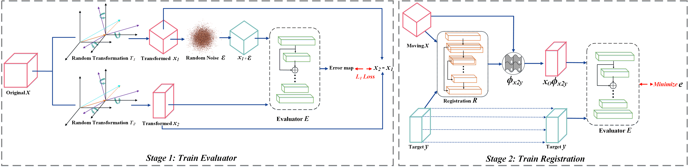

# IMSE


Get the full paper on [Arxiv](https://arxiv.org/pdf/2303.00369.pdf).
This paper has been accepted by [CVPR 2023]

The main codes are divided into 3D full version, 2D full version and 3D pure version. Among them, the pure version only includes the training of the evaluator and the training of registration. It does not include others experiment, which is for the convenience of readers who only focus on the IMSE method.


## Main Reference Environment
1. Linux         (Titan RTX)
2. Python        (3.6.6)
3. torch         (1.9.0+cu111)
5. visdom        (0.1.8.9)
6. numpy         (1.19.2)
7. skimage       (0.15.0)
8. Yaml          (5.4.1)
9. cv2           (3.4.2)
10. PIL          (8.3.2)

## Usage
1. The default data file form is .npy and normalized to [-1,1].
2. Start visdom：
 ```
python -m visdom.server -p 6019
```
If other port parameters are used, you need to modify the port in yaml.

3. Train:
 ```
python main.py
```

